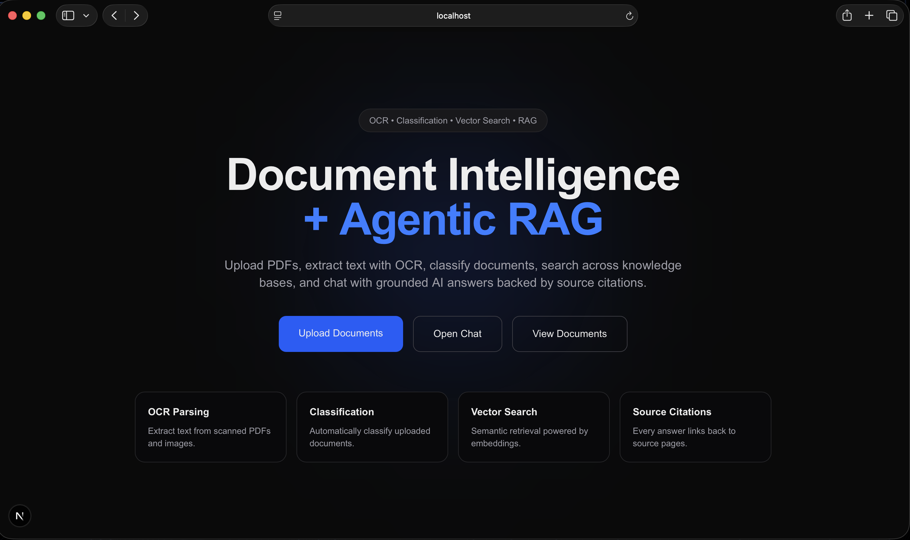
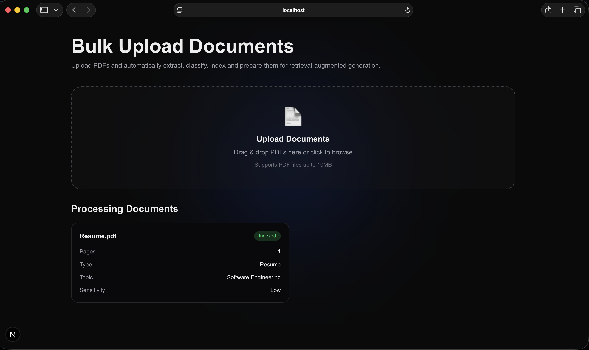
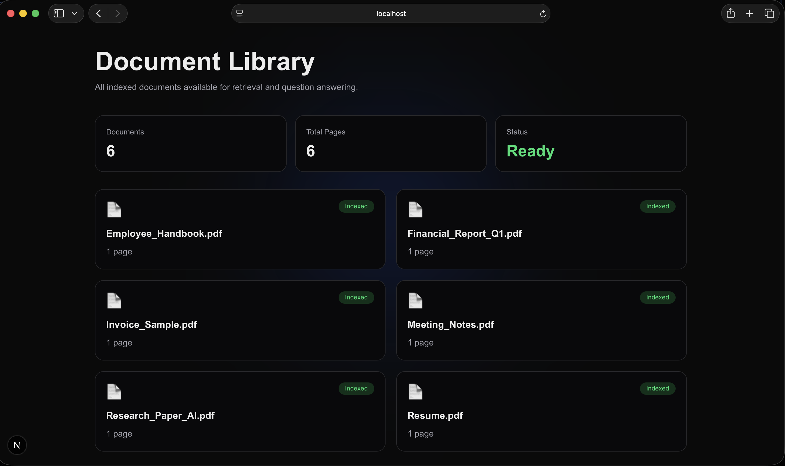
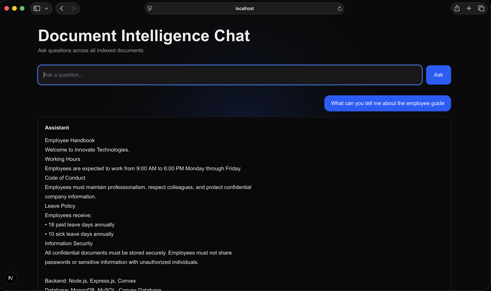
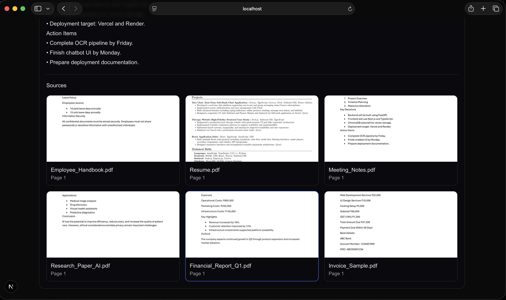

# Document Intelligence + Agentic RAG

## Overview

Document Intelligence + Agentic RAG is a full-stack document understanding platform that ingests real-world documents, extracts content using OCR, classifies documents using an LLM, indexes them with semantic embeddings, and enables users to ask questions through a citation-aware chatbot.

The system is designed to work with scanned PDFs, image-heavy reports, text documents, and structured business documents while providing grounded answers backed by source citations and page previews.

---

## Features

### Document Parsing

* PDF document ingestion
* OCR support for scanned pages using Tesseract
* Page image rendering for every document page
* Plain text extraction
* Support for image-heavy reports
* Storage of both extracted text and page images

### Document Classification

Each uploaded document is automatically classified across multiple dimensions:

* Document Type

  * Invoice
  * Resume
  * Research Paper
  * Meeting Notes
  * Financial Report
  * Employee Handbook
  * Others

* Topic Detection

* Sensitivity Analysis

* Table Detection

Output is returned as structured JSON.

### Agentic RAG

* Semantic retrieval using vector embeddings
* ChromaDB vector database
* Recursive text chunking
* Context-aware retrieval
* Grounded answer generation
* Hallucination prevention through retrieval-first architecture

### Citation System

Every answer includes:

* Source document name
* Page number
* Rendered page thumbnail
* Clickable page preview

### Bulk Upload

* Upload multiple documents simultaneously
* Individual processing status tracking:

  * Parsing
  * Classifying
  * Indexed
  * Failed

### Modern User Interface

* Dark themed dashboard
* Upload center
* Document library
* Chat interface
* Citation previews
* Processing status indicators

---

## Sample Documents Included

The repository includes sample documents so the application works immediately after setup.

Examples include:

* Employee Handbook
* Financial Report
* Invoice
* Meeting Notes
* Research Paper
* Resume

---

## Architecture

### Frontend

* Next.js
* TypeScript
* Tailwind CSS

### Backend

* FastAPI
* ChromaDB
* Sentence Transformers
* Gemini API
* pdfplumber
* pdf2image
* pytesseract

### Storage

* ChromaDB (Vector Store)
* Local File Storage
* Generated Page Images

---

## System Flow

Document Upload

→ File Validation

→ PDF Parsing

→ OCR Extraction

→ Page Image Generation

→ Text Chunking

→ Embedding Generation

→ ChromaDB Indexing

→ Document Classification

→ Ready for Retrieval

---

User Question

→ Query Embedding

→ Vector Search

→ Retrieve Relevant Chunks

→ Build Context

→ Generate Answer

→ Return Citations + Page Images

---

## Project Structure

backend/

* main.py
* rag.py
* parser.py
* classifier.py

frontend/

* app/
* components/
* lib/

storage/

* uploads/
* page_images/
* vector_db/

sample_documents/

* Example PDFs

---

## Setup

### Backend

```bash
cd backend

python -m venv venv

source venv/bin/activate

pip install -r requirements.txt

uvicorn main:app --reload
```

Backend runs on:

```bash
http://127.0.0.1:8000
```

### Frontend

```bash
cd frontend

npm install

npm run dev
```

Frontend runs on:

```bash
http://localhost:3000
```

---

## Security Decisions

### Upload Layer

Implemented:

* File extension validation
* File size limits (10 MB)
* Filename sanitization using pathlib
* Restricted upload directory

Considered:

* Malware scanning
* MIME type verification

Future Improvements:

* Antivirus scanning
* Content-based file validation

### Storage Layer

Implemented:

* Separate upload storage directory
* Isolated page image generation
* Environment variables for secrets

Considered:

* Encryption at rest

Future Improvements:

* Encrypted storage
* Object storage (S3 compatible)

### Processing Layer

Implemented:

* Controlled OCR pipeline
* Exception handling during parsing
* Safe document chunking

Considered:

* Sandboxed processing

Future Improvements:

* Containerized processing workers
* Queue-based document processing

### API & Retrieval Layer

Implemented:

* CORS restrictions
* Query length limits
* Empty-result handling
* Retrieval-based grounding

Considered:

* Authentication
* Rate limiting

Future Improvements:

* JWT authentication
* API rate limiting
* Role-based access control

---

## Screenshots

### Home Page



### Bulk Upload



### Document Library



### Chat Interface



### Citation Preview



---

## Future Improvements

* Table-aware structured extraction
* Multi-modal document understanding
* Voice input support
* Streaming AI responses
* Authentication system
* Cloud storage integration
* Multi-user support
* Advanced agent workflows

---

## Tech Stack

Frontend

* Next.js
* TypeScript
* Tailwind CSS

Backend

* FastAPI
* ChromaDB
* Sentence Transformers
* Gemini API

Document Processing

* pdfplumber
* pdf2image
* pytesseract

---
